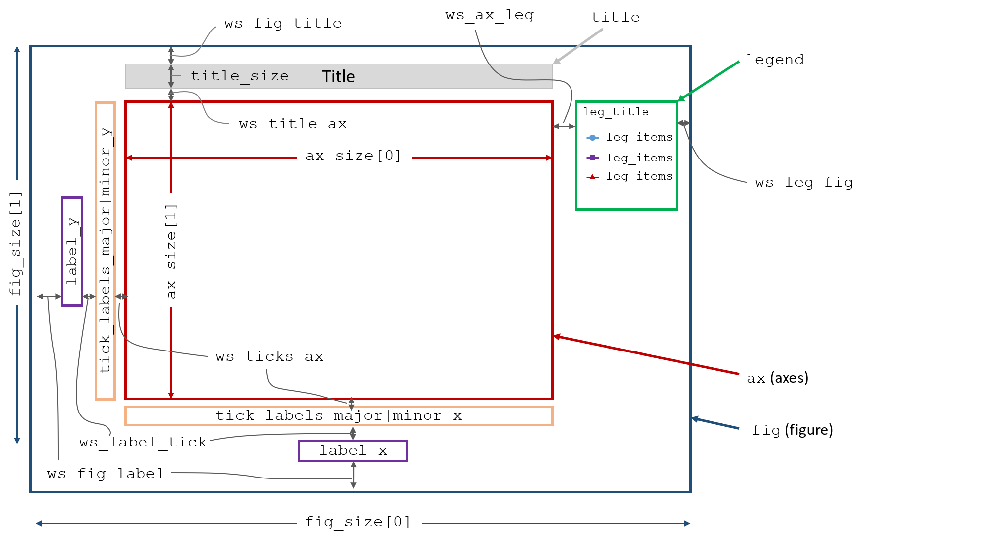

Layout and Elements
===================

All plots consist of some number of "elements" that are arranged in a spatial "layout".
Each of these "elements" has various attributes that define its style. Consider the following plot, showing
the layout region outlined in black along with several "elements" (circled or highlighted in yellow):

.. image:: ../_static/images/layout_element.png

The "layout":

   * defines the size of the entire plotting canvas
   * defines the position of each element within the canvas, which in turn defines the whitespace between elements
   * is largely determined by "grouping" options (such as `row`, `col`, `wrap`)
   * is defined by a ``Layout`` class in **fivecentplots**.  This "layout" is built upon the backbone of an existing
     plotting library (aka "engine") in Python, such as **matplotlib** or **bokeh**.

.. note:: Although each plotting library in Python has a unique API, the ``Layout`` class in **fivecentplots** wraps
          the module-specific function calls and commands of the library to provides a new, unified API that is
          module-independent.  This new, common API uses a keywords-only approach as described in the
          `next <keyword.html>`_ section and means that the same **fivecentplots**  plot command can be used to
          create a plot in say **matplotlib** *or* in **bokeh** (assuming the particular plot type has been wrapped).

An "element":

   * is a rendered object placed within the layout (such as the axis area, the plot lines, the data markers, a legend
     box, etc.)
   * is styled by specific attributes related to that element (i.e., font size, fill color, edge color alpha, etc.)
   * is defined by an ``Element`` class in **fivecentplots**

Simple Layout Schematic
-----------------------

A schematic of a single-axis ``Layout`` (i.e., no grouping) is shown below.  The ``Layout`` will automatically
adjust in size to accommodate the ``Element`` objects that have been enabled.  The whitespace between ``Element``
objects can also be modified by the user by overriding the appropriate keywords.

.. note:: All of these size and whitespace parameters have defaults that can be changed at function call time
          via keyword arguments or globally with a custom theme file.  Whitespace keywords are detailed further in
          `the "ws" API section <api/ws.html>`_

Grid Layout Schematic
---------------------

With **fivecentplots** we can easily extend the simple single-axis plot and make a grid of subplots, which  enables
additional ``Layout`` parameters illustrated below:

.. image:: ../_static/images/layout_grid.png

Elements
--------
The following list outlines the ``Element`` objects available.  More details about the style and other keyword options
for these "elements" can be found `in the API section <api.html>`_  Usage examples are also provided in the "Plot Types"
section of the docs.

   * **ax_hlines**:  Element object for horizontal lines
   * **ax_vlines**:  Element object for vertical lines
   * **ax2_hlines**:  Element object for horizontal lines on secondary axis
   * **ax2_vlines**:  Element object for vertical lines on secondary axis
   * **axes**:  Element object for the axis
   * **axes2**:  Element object for the secondary axis
   * **bar**:  Element object for barchart plot
   * **box**:  Element object for box plot
   * **box_divider**:  Element object for divider lines between box groups
   * **box_grand_mean**:  Element object for grand mean line plot on box plot
   * **box_grand_median**:  Element object for grand median line plot on box plot
   * **box_group_means**:  Element object for group mean line plots on box plot
   * **box_group_label**:  Element object for box plot group label text
   * **box_group_title**:  Element object for box plot group title text
   * **box_mean_diamonds**:  Element object for mean diamond overlays on box plot
   * **box_range_lines**:  Element object for box plot range line styling
   * **box_stat_line**:  Element object for arbitrary stat line plot on box plot
   * **box_whisker**:  Element object for bow whisker line styling
   * **cbar**:  Element object for colorbar
   * **contour**:  Element object for contour plot
   * **fig**:  Element object for the figure
   * **fit**:  Element object for fit line
   * **gantt**:  Element object for gannt chart
   * **grid_major**:  Element object with default values for major grids not explicitly defined
   * **grid_major_x**:  Element object for x major grid (defaults to self.grid_major)
   * **grid_major_x2**:  Element object for x2 major grid (defaults to self.grid_major)
   * **grid_major_y**:  Element object for y major grid (defaults to self.grid_major)
   * **grid_major_y2**:  Element object for y2 major grid (defaults to self.grid_major)
   * **grid_minor**:  same as above but for minor grid
   * **grid_minor_x**:  same as above but for minor grid
   * **grid_minor_x2**:  same as above but for minor grid
   * **grid_minor_y**:  same as above but for minor grid
   * **grid_minor_y2**:  same as above but for minor grid
   * **heatmap**:  Element object for heatmap plot
   * **hist**:  Element object for histogram plot
   * **imshow**:  Element object for imshow plot
   * **interval**:  Element object for conf, percentile, nq interval ranges
   * **label_col**:  Element object for col label text
   * **label_row**:  Element object for row label text
   * **label_wrap**:  Element object for wrap label text
   * **label_x**:  Element object for the x-label
   * **label_x2**:  Element object for the secondary x-label
   * **label_y**:  Element object for the y-label
   * **label_y2**:  Element object for the secondary y-label
   * **label_z**:  Element object for the z-label
   * **lcl**:  Element object for lower control limit shading
   * **legend**:  Legend_Element for figure legend
   * **lines**:  Element object for plot lines
   * **markers**:  Element object for markers
   * **pie**:  Element object for pie chart
   * **ref_line**:  Element object for reference line
   * **rolling_mean**:  Element object for the rolling mean XY plot on bar chart
   * **text**:  Element object for arbitrary text
   * **tick_labels_major**:  Element object with default values for tick labels not explicitly defined
   * **tick_labels_major_x**:  Element object for x major tick labels (defaults to self.tick_labels_major)
   * **tick_labels_major_x2**:  Element object for x2 major tick labels (defaults to self.tick_labels_major)
   * **tick_labels_major_y**:  Element object for y major tick labels (defaults to self.tick_labels_major)
   * **tick_labels_major_y2**:  Element object for y2 major tick labels (defaults to self.tick_labels_major)
   * **tick_labels_major_z**:  Element object for z major tick labels (defaults to self.tick_labels_major)
   * **tick_labels_minor**:  same as above but for minor tick labels
   * **tick_labels_minor_x**:  same as above but for minor tick labels
   * **tick_labels_minor_x2**:  same as above but for minor tick labels
   * **tick_labels_minor_y**:  same as above but for minor tick labels
   * **tick_labels_minor_y2**:  same as above but for minor tick labels
   * **ticks_major**:  Element object with default values for ticks not explicitly defined
   * **ticks_major_x**:  Element object for x major ticks (defaults to self.ticks_major)
   * **ticks_major_x2**:  Element object for x2 major ticks (defaults to self.ticks_major)
   * **ticks_major_y**:  Element object for y major ticks (defaults to self.ticks_major)
   * **ticks_major_y2**:  Element object for y2 major ticks (defaults to self.ticks_major)
   * **ticks_minor**:  same as above but for minor ticks
   * **ticks_minor_x**:  same as above but for minor ticks
   * **ticks_minor_x2**:  same as above but for minor ticks
   * **ticks_minor_y**:  same as above but for minor ticks
   * **ticks_minor_y2**:  same as above but for minor ticks
   * **ticks_minor_x_number**:  number of x-axis minor ticks
   * **ticks_minor_x2_number**:  number of x2-axis minor ticks
   * **ticks_minor_y_number**:  number of y-axis minor ticks
   * **ticks_minor_y2_number**:  number of y2-axis minor ticks
   * **title**:  Element object for the plot title
   * **title_wrap**:  Element object for title text in wrap plot
   * **violin**:  Element object for box plot violins
   * **ucl**:  Element object for upper control limit shading

Engine
------
As mentioned elsewhere, **fivecentplots** is a simplified interface to *exisitng* Python plotting packages.  Conversion
from keyword arguments into the plotting-engine-specific code occurs behind-the-scenes within an engine-specific
`Layout` class.  Wherever possible, `Element` objects share the same name and as many common attributes as possible.
However, there are instances when a certain `Element` only exists within one "engine" and a unique keyword must be
defined.  That said, the goal is always Tolkien-esque: *one API to rule them all*.  More details on plotting engines
is available in the `Engines <engines/index.html>`_ section.

.. warning:: Support for multiple engines is a work in progress.  Please file a bug report if something you need
             is missing.

