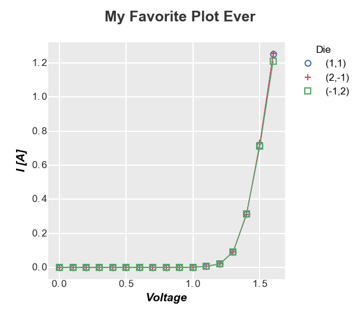

Layout
======

All plots consist of some number of "elements" that are arranged in a spatial "layout".
Each of these "elements" can be styled to adjust the look and feel of a plot.  Examples
of common plot "elements" include: the axes area, text and tick labels, lines, legends, etc.

In **fivecentplots**, an ``Element`` class contains all of the format/style attributes
of that component.  The placement of these ``Element`` objects in the plot area is controlled
by a ``Layout`` class.  A ``Layout`` is built upon existing plotting library (aka "engine") in Python, such as
**matplotlib** or **bokeh**.  Although these engines have custom APIs, the ``Layout`` class
unifies access to various ``Element`` and ``Layout`` parameters across plotting modules.
This is accomplished using optional keyword arguments provided by the user in the plotting function call
or a simple theme file.

This section will explain the important details of the plot layout in **fivecentplots**.  Keyword arguments
will be covered in the `next <keyword.html>`_ section.

Example plot
------------

An simple x-y plot is shown below, which includes the following ```Element`` objects:

   * ``fig``: defines the area outside of the axes area where the plot is displayed
   * ``axes``: defines the plot background color, size, axes scale, etc.
   * ``label_x`` and ``label_y``: define the x and y label text, color, font size, etc
   * ``tick_labels`` and ``tick_marks``: define the look of the ticks and labels around the axes
   * ``legend``: defines the location, edge color, background color, and font size of the legend on the right side of the plot
   * ``grid_major``: defines the color, width, and style of the major gridlines
   * ``title``: defines the text format of the title
   * ``lines``: defines the width, style, and color of the plot lines
   * ``markers``: defines the marker edge color, fill color, and type




Simple Layout Schematic
-----------------------

All ``Element`` objects are positioned by the ``Layout`` class as shown in the schematic diagram below.
Within the ``Layout`` there are many user-adjustable options for ``Element`` sizes and the amount of whitespace
separating all items, as illustrated in this drawing.


.. image:: _static/images/layout.png

.. note:: All of these size and whitespace parameters have defaults that can be changed with a custom theme file or kwargs in the plot function.

Grid Layout Schematic
---------------------

With **fivecentplots** we can easily extend the simple single-axis plot and make a grid of subplots.
This plot option enables some additional ``Layout`` parameters illustrated below:

.. image:: _static/images/layout_grid.png


.. note:: All of these size, grid, and whitespace parameters have defaults that can be changed with a custom theme file or kwargs in the plot function.


Engine
------
**fivecentplots** is *not a new graphics generation library*.  In fact, plots are created using existing Python plotting
packages.  These "engines" are wrapped by **fivecentplots** to provide a new, simpler API that allows complex
plotting via kwargs.  All unique and complicated API calls of a given plotting package are handled behind the scenes.
The most mature "engine" supported by **fivecentplots** is ``matplotlib`` which is enabled by default.  Currently,
there is limited support for ``bokeh``, but this will grow in the future.  Additional "engines" could easily be supported
through the creation of a new ``Layout`` class (volunteers welcome!).  Using this approach of API unification through kwargs,
**fivecentplots** enables the user to switch between plotting engines by changing only one kwarg, ``engine``.  Besides this
the plot call remains *exactly the same*.

For example, say you need a high-quality plot for a paper and prefer to use **matplotlib**, you
could do the following:

.. code:: python

   fcp.plot(df, x='Voltage', y='I [A]', legend='Die',
            filter='Substrate=="Si" & Target Wavelength==450 & Boost Level==0.2 & Temperature [C]==25')

.. image:: _static/images/engine_mpl.png

.. note:: Notice that ``engine`` is not explicitly called above because **matplotlib** is assumed by default.

Now suppose you need to interactively manipulate the same data set, thus making a static image less attractive.
You could switch "engines" and plot via **bokeh**, all with the addition of just one keyword ``engine='bokeh'``:

.. code:: python

   fcp.plot(df, x='Voltage', y='I [A]', legend='Die', engine='bokeh',
            filter='Substrate=="Si" & Target Wavelength==450 & Boost Level==0.2 & Temperature [C]==25')

.. image:: _static/images/engine_bokeh.png
   :height: 471px

All with only **one** kwarg change!

.. note:: As of version 0.5.0, **bokeh** support is limited compared with **matplotlib**.  More
          development is needed.  Not all plot types are available at this time.

