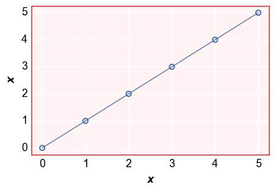
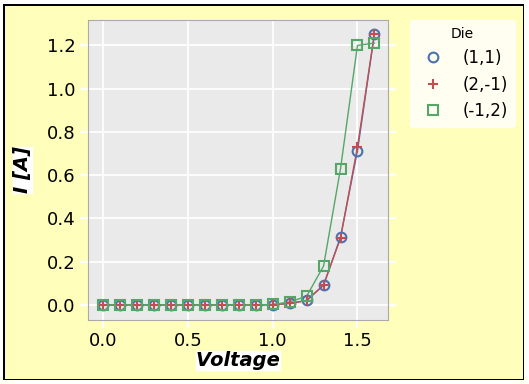

.. role:: hh

Keyword Arguments
=================

Required args and kwargs
------------------------

All plot types require input data in the form  of a pandas ``DataFrame``.

.. note:: A few plot types that use 2D arrays of data where ``DataFrame`` column names are meaningless (like ```imshow```) will
          also allow ```numpy.ndarrays```.  However, in order to do grouping into multiple subplots a ``DataFrame`` is still needed
          to provide the grouping columns.

Additionally, plots will require at least one column name to specify what data should be plotted.  These values are supplied
as kwargs, not args, so that order of the arguments doesn't matter.  The table below describes the required args and kwargs
for various plot types:

+---------+----------------------+------------------------------------------------------------------------+----------------------------------------------------------------------------------------------------------------------+
| Keyword | Data Type            | Description                                                            | Required?                                                                                                            |
+=========+======================+========================================================================+======================================================================================================================+
| df      | pandas ``DataFrame`` | DataFrame containing all data to be plotted including grouping columns | always (**note:** ``df`` can also be specified as the first function argument withouth the keyword name of ``df==``) |
+---------+----------------------+------------------------------------------------------------------------+----------------------------------------------------------------------------------------------------------------------+
| x       | str                  | Column name of the x-axis data (horizontal axis)                       | all except:                                                                                                          |
|         | or                   |                                                                        |                                                                                                                      |
|         | list of str          |                                                                        | * ``boxplot``                                                                                                        |
|         |                      |                                                                        | * ``imshow`` (if using 2D array of data)                                                                             |
|         |                      |                                                                        | * ``nq`` (if using 2D array of data)                                                                                 |
+---------+----------------------+------------------------------------------------------------------------+----------------------------------------------------------------------------------------------------------------------+
| y       | str                  | Column name of the y-axis data (vertical axis)                         | all except:                                                                                                          |
|         | or                   |                                                                        |                                                                                                                      |
|         | list of str          |                                                                        | * ``imshow`` (if using 2D array of data)                                                                             |
|         |                      |                                                                        | * ``nq`` (if using 2D array of data)                                                                                 |
+---------+----------------------+------------------------------------------------------------------------+----------------------------------------------------------------------------------------------------------------------+
| z       | str                  | Column name of the z-axis data                                         | only for contour and heatmap                                                                                         |
+---------+----------------------+------------------------------------------------------------------------+----------------------------------------------------------------------------------------------------------------------+

.. note:: A full description of all required args is provided in the documentation for each plot type or in the `API section <modules.html>`_

Optional kwargs
---------------
The characteristics of all other "elements" in the plot and the layout of these "elements" within the plot or subplots are defined completely by
optional keyword arguments.  These kwargs can be specified in the plot function call or they can be pulled from a simple `theme file <themes.html>`_.
If the kwarg is not found in either of these locations, a hard-coded default value is used.

Because the number of kwargs is vast, we will not outline all of them here.  However, we will give some general guidelines and refer the user to
the `full API <modules.html>`_.

Nomenclature
^^^^^^^^^^^^
Keywords that access the attributes of an "element" *typically* follow a specific formula:

.. raw:: html

    <div class="admonition note">
    <p class="first admonition-title">Keyword Naming Scheme</p>
    <p class="last">&lt;element name&gt;_&lt;major|minor axis type (if any)&gt;_&lt;x|y|z axis (if any)&gt;_&lt;element attribute name&gt;</p>
    </div>


Consider some examples:

    1) Set the x label font color to red:

        **label_x_font_color = '#FF0000'**

    2) Set the y-axis minor gridline width to 2 pixels:

        **grid_major_y_width = 2**

    3) Set the axes edge color to black:

        **ax_edge_color = '#000000'**

    4) Set the whisker color in a box plot:

        **box_whisker_color = #FF00FF**

    5) Display the fit equation and rsq value of a line fit:

        **fit_eqn = True**
        **fit_rsq = True**

    6) Set a different marker size just for the legend

        **legend_marker_size = 8**

.. note:: For convenience, there are a handful of keywords that allow a shorthand notation when
          defining them within the function call.  For example, if you are calling ``fcp.boxplot``
          and want to convert the box to a violin, you can use either ``box_violin=True``
          or ``violin=True``.  Since it is obvious from the function call that these violins belong
          to this plot type, we allow the user to abbreviate.  However, the long form of such values
          is still required in theme files in case of overlap with other plot types.


Getting Help
------------
Help regarding keywords is available by:

    1) ``fcp.docs()``: loads the docs where you can find the API section

    2) ``help(fcp.some_function_or_element)``: prints the args and kwargs that apply

        .. image:: _static/images/help.png
           :width: 800px

        To help with finding kwargs, ``fcp.py`` contains a number of dummy functions for various "elements".  These functions
        have no actual function in the plotting, but exist solely to provide docstrings.  These include:

        * ``axes``
        * ``cbar`` (color bars)
        * ``figure``
        * ``grouping``
        * ``gridlines``
        * ``labels``
        * ``legend``
        * ``lines``
        * ``markers``
        * ``ticks``
        * ``tick_labels``
        * ``ws`` (whitespace)

Base attributes
^^^^^^^^^^^^^^^

Each ``Element`` object contains a basic set of attributes which may or may not be used
depending on the specifics of the element:

+----------+-------------+---------------------------------------------------------------------------------+------------+------------------+
| Category | Keyword     | Description                                                                     | Default    | Example          |
+==========+=============+=================================================================================+============+==================+
| Fill     | fill_alpha  | fill color opacity [0 (fully transparent) - 1 (opaque)]                         | 1          | https://test.org |
+          +-------------+---------------------------------------------------------------------------------+------------+------------------+
|          | fill_color  | fill color (hex color code)                                                     | #ffffff    | https://test.org |
+----------+-------------+---------------------------------------------------------------------------------+------------+------------------+
| Edges    | edge_alpha  | edge color opacity  [0 (fully transparent) - 1 (opaque)]                        | 1          | https://test.org |
+          +-------------+---------------------------------------------------------------------------------+------------+------------------+
|          | edge_width  | width in pixels of the element border                                           | 1          | https://test.org |
+          +-------------+---------------------------------------------------------------------------------+------------+------------------+
|          | edge_color  | edge color (hex color code)                                                     | #ffffff    | https://test.org |
+----------+-------------+---------------------------------------------------------------------------------+------------+------------------+
| Fonts    | font        | font name for element text                                                      | sans-serif | https://test.org |
+          +-------------+---------------------------------------------------------------------------------+------------+------------------+
|          | font_color  | font color (hex color code)                                                     | #000000    | https://test.org |
+          +-------------+---------------------------------------------------------------------------------+------------+------------------+
|          | font_size   | font size in pixels                                                             | 14         | https://test.org |
+          +-------------+---------------------------------------------------------------------------------+------------+------------------+
|          | font_style  | font style ['normal', 'italic', 'oblique']                                      | normal     | https://test.org |
+          +-------------+---------------------------------------------------------------------------------+------------+------------------+
|          | font_weight | font weight ['light', 'normal', 'medium', 'semibold', 'bold', 'heavy', 'black'] | normal     | https://test.org |
+----------+-------------+---------------------------------------------------------------------------------+------------+------------------+
| Lines    | alpha       | line opacity                                                                    | 1          | https://test.org |
+          +-------------+---------------------------------------------------------------------------------+------------+------------------+
|          | color       | line color (hex color code)                                                     | #000000    | https://test.org |
+          +-------------+---------------------------------------------------------------------------------+------------+------------------+
|          | style       | line style ['-', '--', '-.', ':']                                               | -          | https://test.org |
+          +-------------+---------------------------------------------------------------------------------+------------+------------------+
|          | width       | line width in pixels                                                            | 1          | https://test.org |
+----------+-------------+---------------------------------------------------------------------------------+------------+------------------+
| Other    | on          | toggle visibility of the element                                                | depends    | https://test.org |
+          +-------------+---------------------------------------------------------------------------------+            +                  +
|          | size        | [width, height] of the object                                                   |            |                  |
+          +-------------+---------------------------------------------------------------------------------+            +                  +
|          | text        | label text associated with the object                                           |            |                  |
+----------+-------------+---------------------------------------------------------------------------------+------------+------------------+

Axes
^^^^


The ``axes`` element consists of the actual plotting window shown in yellow above.
Keywords for the primary ``axes`` object begin with the prefix "ax_".  Properties
of any optional secondary axes begin with the prefix "ax2_".

+---------------+---------------------------+-----------------------------------------------------------------------------------------+------------+--------------------------------------------------+
| Keyword       | Data Type                 | Description                                                                             | Default    | Example                                          |
+===============+===========================+=========================================================================================+============+==================================================+
| ax_edge_color | hex color string          | outer edge color of plot area                                                           | #aaaaaa    | None                                             |
+---------------+---------------------------+-----------------------------------------------------------------------------------------+------------+--------------------------------------------------+
| ax_fill_color | hex color string          | inner fill color of plot area                                                           | #eaeaea    | None                                             |
+---------------+---------------------------+-----------------------------------------------------------------------------------------+            +--------------------------------------------------+
| ax_scale      | str                       | enable linear vs log scaling of axis                                                    |            | `log scale plot <plot.html#Log-scale>`_          |
+               +                           +-----------------------------------------------------------------------------------------+            +                                                  +
|               |                           | x-axis: ['linear', 'logx', 'semilogx']                                                  |            |                                                  |
+               +                           +-----------------------------------------------------------------------------------------+            +                                                  +
|               |                           | y-axis: ['linear', 'logx', 'semilogx']                                                  |            |                                                  |
+               +                           +-----------------------------------------------------------------------------------------+            +                                                  +
|               |                           | both: ['loglog', 'log']                                                                 |            |                                                  |
+               +                           +-----------------------------------------------------------------------------------------+            +                                                  +
|               |                           | other: ['symlog', 'logit']                                                              |            |                                                  |
+---------------+---------------------------+-----------------------------------------------------------------------------------------+------------+--------------------------------------------------+
| ax_size       | list of ints              | width, height of plot area                                                              | [400, 400] | None                                             |
+---------------+---------------------------+-----------------------------------------------------------------------------------------+------------+                                                  +
| spines        | boolean                   | show all axis edges                                                                     | True       |                                                  |
+---------------+---------------------------+-----------------------------------------------------------------------------------------+------------+                                                  +
| spine_bottom  | boolean                   | show bottom axis edge                                                                   | True       |                                                  |
+---------------+---------------------------+-----------------------------------------------------------------------------------------+------------+                                                  +
| spine_left    | boolean                   | show left axis edge                                                                     | True       |                                                  |
+---------------+---------------------------+-----------------------------------------------------------------------------------------+------------+                                                  +
| spine_right   | boolean                   | show right axis edge                                                                    | True       |                                                  |
+---------------+---------------------------+-----------------------------------------------------------------------------------------+------------+                                                  +
| spine_top     | boolean                   | show top axis edge                                                                      | True       |                                                  |
+---------------+---------------------------+-----------------------------------------------------------------------------------------+------------+--------------------------------------------------+
| twin_x        | boolean                   | enable/disable a secondary y-axis (x-axis is "twinned" or duplicated across two y-axes) | False      | `twin_x plot <plot.html#Shared-x-axis-twin_x>`_  |
+---------------+---------------------------+-----------------------------------------------------------------------------------------+------------+--------------------------------------------------+
| twin_y        | boolean                   | enable/disable a secondary x-axis (y-axis is "twinned" or duplicated across two x-axes) | False      | `twin_y plot <plot.html#Shared-y-axis-twin_y>`_  |
+               +                           +-----------------------------------------------------------------------------------------+            +                                                  +
|               |                           | Note:  wrap plots cannot be used when ``twin_y == True``                                |            |                                                  |
+---------------+---------------------------+-----------------------------------------------------------------------------------------+------------+--------------------------------------------------+
| xmin          | float|list of floats|None | minimum x-values; can use a list for each subplot                                       | None       | `primary axis <ranges.html#Primary-axes-only>`_  |
+---------------+---------------------------+-----------------------------------------------------------------------------------------+------------+--------------------------------------------------+
| x2min         | float|list of floats|None | minimum x-values; can use a list for each subplot                                       | None       | `secondary axis <ranges.html#Secondary-y-axis>`_ |
+---------------+---------------------------+-----------------------------------------------------------------------------------------+------------+--------------------------------------------------+
| xmax          | float|list of floats|None | maximum x-values; can use a list for each subplot                                       | None       | `primary axis <ranges.html#Primary-axes-only>`_  |
+---------------+---------------------------+-----------------------------------------------------------------------------------------+------------+--------------------------------------------------+
| x2max         | float|list of floats|None | maximum x-values for secondary axis; can use a list for each subplot                    | None       | `secondary axis <ranges.html#Secondary-y-axis>`_ |
+---------------+---------------------------+-----------------------------------------------------------------------------------------+------------+--------------------------------------------------+
| ymin          | float|list of floats|None | minimum y-values; can use a list for each subplot                                       | None       | `primary axis <ranges.html#Primary-axes-only>`_  |
+---------------+---------------------------+-----------------------------------------------------------------------------------------+------------+--------------------------------------------------+
| y2min         | float|list of floats|None | minimum y-values for secondary axis; can use a list for each subplot                    | None       | `secondary axis <ranges.html#Secondary-y-axis>`_ |
+---------------+---------------------------+-----------------------------------------------------------------------------------------+------------+--------------------------------------------------+
| ymax          | float|list of floats|None | maximum y-values; can use a list for each subplot                                       | None       | `primary axis <ranges.html#Primary-axes-only>`_  |
+---------------+---------------------------+-----------------------------------------------------------------------------------------+------------+--------------------------------------------------+
| y2max         | float|list of floats|None | maximum y-values for secondary axis; can use a list for each subplot                    | None       | `secondary axis <ranges.html#Secondary-y-axis>`_ |
+---------------+---------------------------+-----------------------------------------------------------------------------------------+------------+--------------------------------------------------+

The following base attributes of the ``Element`` class are not used for this item:

   * "Fonts" category
   * "Lines" category
   * ``text``


Boxplots
^^^^^^^^
.. image:: _static/images/element_box.png

Boxplots have several unique ``Element`` objects that can be styled:

    * **Boxes:**  the actual boxes of the box plot (shown in white with a
      blue border above) are accessed using keywords with the prefix ``box_``:

      +------------------+-----------+------------------------------------------------------+---------+-------------------------------------------+
      | Keyword          | Data Type | Description                                          | Default | Example                                   |
      +==================+===========+======================================================+=========+===========================================+
      | box_on           | boolean   | toggle box visibility                                | True    | `box plot <boxplot.html#multipe-groups>`_ |
      +------------------+-----------+------------------------------------------------------+---------+                                           +
      | box_edge_color   | str       | edge color of the boxes                              | #4b72b0 |                                           |
      +------------------+-----------+------------------------------------------------------+---------+                                           +
      | box_fill_color   | str       | fill color of the boxes                              | #ffffff |                                           |
      +------------------+-----------+------------------------------------------------------+---------+                                           +
      | box_median_color | str       | color of the median line within the boxes            | #ff7f0e |                                           |
      +------------------+-----------+------------------------------------------------------+---------+                                           +
      | notch            | boolean   | use a notched-style box instead of a rectangular box | False   |                                           |
      +------------------+-----------+------------------------------------------------------+---------+-------------------------------------------+

|

    * **Divider lines:**  optional vertical divider lines between groups

      These lines are styled using keywords with the prefix ``box_divider`` and use
      the "Lines" category of base attributes for the ``Element`` object.  They are
      enabled by default but can be turned off with ``box_divider=False``:

      +-------------------+-----------+--------------------------------------------+---------+
      | Keyword           | Data Type | Description                                | Default |
      +===================+===========+============================================+=========+
      | box_divider_on    | boolean   | toggle divider lines between groups on/off | True    |
      +-------------------+-----------+--------------------------------------------+---------+
      | box_divider_color | str       | line color                                 | #bbbbbb |
      +-------------------+-----------+--------------------------------------------+---------+

|

    * **Group labels:** labels directly under each box that indicate the unique group values
      of the given box (shown in yellow above).

      .. raw:: html

         <div class="admonition note">
         <p class="first admonition-title">Keyword Prefix</p>
         <p class="last"><b>box_group_label_</b></p>
         </div>


      These labels are styled using keywords with the prefix ``box_group_label_`` and
      are similar to other `label <keyword.html#labels>`_ elements.

|

    * **Group titles:** labels to the right of the group labels that indicate the DataFrame
      column name of each grouping column (shown in salmon above).

      These labels are controlled using keywords with the prefix ``box_group_title_`` and
      are similar to other `label <keyword.html#labels>`_ elements.

|

    * **Range lines:** optional lines within a single box that span the entire range of the
      data set.  These are useful for visualization of outlier points that may be
      outside of the selected ymin/ymax range.  They are accessed using keywords with the
      prefix ``box_range_lines_``:

      +------------------------+-----------+------------------------------------------------------------------------+---------+
      | Keyword                | Data Type | Description                                                            | Default |
      +========================+===========+========================================================================+=========+
      | box_range_lines_on     | boolean   | toggle range lines on/off                                              | True    |
      +------------------------+-----------+------------------------------------------------------------------------+---------+
      | box_range_lines_color  | str       | line color                                                             | #cccccc |
      +------------------------+-----------+------------------------------------------------------------------------+---------+
      | box_range_lines_style  | str       | horizontal lines at the end of the range                               | -       |
      +------------------------+-----------+------------------------------------------------------------------------+---------+
      | box_range_lines_style2 | str       | vertical lines connecting the horizontal lines at the end of the range | --      |
      +------------------------+-----------+------------------------------------------------------------------------+---------+

|

    * **Stat lines:** optional connecting line between each box at some statistical
      value calculated from the data for a single box.  Options include any stat that
      can be computed via the ``groupby`` command on a pandas DataFrame (i.e., "mean",
      "median", "std", etc.).  Box stat lines are accessed using keywords with the prefix
      ``box_stat_line_``:

     +---------------------+-----------+--------------------------------------------+---------+
     | Keyword             | Data Type | Description                                | Default |
     +=====================+===========+============================================+=========+
     | box_stat_line_on    | boolean   | toggle divider lines between groups on/off | True    |
     +---------------------+-----------+--------------------------------------------+---------+
     | box_stat_line       | str       | set the statistic for the connecting line  | mean    |
     +---------------------+-----------+--------------------------------------------+---------+
     | box_stat_line_color | str       | line color                                 | #666666 |
     +---------------------+-----------+--------------------------------------------+---------+

Color Bar
^^^^^^^^^
A color bar (or "cbar") is a colorized gradient scale used to signify the z-value
of data plotted in an X-Y plane on a contour or heatmap plot.  By default, the color
bar is disabled.

+------------+-----------+-------------------------------------------------------+---------+--------------------------------------------------+
| Keyword    | Data Type | Description                                           | Default | Example                                          |
+============+===========+=======================================================+=========+==================================================+
|      cbar  | boolean   | toggle colorbar on/off for contour and heatmap plots  | False   | `contour example <contour.html#Filled-contour>`_ |
+------------+-----------+-------------------------------------------------------+---------+                                                  +
| size       | int       | cbar width (height will match the height of the axes) | 30      |                                                  |
+------------+-----------+-------------------------------------------------------+---------+--------------------------------------------------+

The color bar text label is pulled from the column name supplied for the keyword
``z``, but can be overriden via the keyword ``label_z``.  All font keywords which
belong to the base ``Element`` class can be used to style the color bar text.

The following base attributes of the ``Element`` class are not used for this item:

    * "Lines" category
    * ``text``

Confidence Intervals
^^^^^^^^^^^^^^^^^^^^
See `Stats <keyword.html#stats>`_


Contour
^^^^^^^
Contour plots have a few options that can be specified via keyword:

+--------------+-----------+----------------------------------------+---------+--------------------------------------------------+
| Keyword      | Data Type | Description                            | Default | Example                                          |
+==============+===========+========================================+=========+==================================================+
|      cmap    | str       | Name of a color map                    | inferno | `contour example <contour.html#Filled-contour>`_ |
+--------------+-----------+----------------------------------------+---------+                                                  +
|      filled  | boolean   | Fill area between contour lines        | True    |                                                  |
+--------------+-----------+----------------------------------------+---------+                                                  +
|      levels  | int       | Number of contour lines/levels to draw | 20      |                                                  |
+--------------+-----------+----------------------------------------+---------+--------------------------------------------------+


Figure
^^^^^^



.. note::

   To style the figure region in yellow for this example, the following keywords were
   used in the ``fcp.plot`` command:

   .. code-block:: python

      fig_edge_color='#000000', fig_fill_color='#fffd75', fig_fill_alpha=0.5

   Notice, we are just accessing default ``Element`` class attributes and prepending
   the keywords with the element name, ``fig_`` in this case.


The ``figure`` element is the full window in which other elements are rendered.
Most of the ``figure`` region is covered by these other elements but the visible
portion (shown in yellow above) can be styled.  ``figure`` elements can also
be subdivided into multiple subplots to display more data.  Unlike matplotlib, **the**
**size of the figure window is caluculated automatically by the sizes of the discrete**
**elements it contains.  It cannot be set directly.**

.. raw:: html

    <div class="admonition note">
    <p class="first admonition-title">Keyword Prefix</p>
    <p class="last"><b>fig_</b></p>
    </div>

+-----------+-----------+---------------+---------+
| Keyword   | Data Type | Description   | Default |
+===========+===========+===============+=========+
|      dpi  | int       | dots per inch | 100     |
+-----------+-----------+---------------+---------+

The following base attributes of the ``Element`` class are not used for this item:

    * "Fonts" category
    * "Lines" category
    * ``on``
    * ``size``
    * ``text``


Fit
^^^
**fivecentplots** can add a polynomial fit to a data set.  This is controlled via
the family of keywords beginning with ``fit_``:

+---------------+---------------+---------------------------------------------------------------------------+---------+-------------------------------------------------+
| Keyword       | Data Type     | Description                                                               | Default | Example                                         |
+===============+===============+===========================================================================+=========+=================================================+
| fit           | int           | polynomial degree for the fit                                             | None    | `Line fit <plot.html#Line-fit>`_                |
+---------------+---------------+---------------------------------------------------------------------------+---------+-------------------------------------------------+
| fit_color     | hex color str | color of the fit line                                                     | #000000 | None                                            |
+---------------+---------------+---------------------------------------------------------------------------+---------+-------------------------------------------------+
| fit_eqn       | boolean       | display the fit equation on the plot                                      | False   | None                                            |
+---------------+---------------+---------------------------------------------------------------------------+---------+-------------------------------------------------+
| fit_font_size | float         | font size of the fit eqn and rsq value                                    | 12      | None                                            |
+---------------+---------------+---------------------------------------------------------------------------+---------+-------------------------------------------------+
| fit_padding   | int           | padding in pixels from the top of the plot to the location of the fit eqn | 10      | None                                            |
+---------------+---------------+---------------------------------------------------------------------------+---------+-------------------------------------------------+
| fit_range_x   | list          | compute the fit only over a given range of x-values                       | None    | `third example here <plot.html#Curve-fitting>`_ |
+---------------+---------------+---------------------------------------------------------------------------+---------+                                                 +
| fit_range_y   | list          | compute the fit only over a given range of y-values                       | None    |                                                 |
+---------------+---------------+---------------------------------------------------------------------------+---------+-------------------------------------------------+
| fit_rsq       | boolean       | display the rsq of the fit on the plot                                    | False   | None                                            |
+---------------+---------------+---------------------------------------------------------------------------+---------+-------------------------------------------------+

The following base attributes of the ``Element`` class are not used for this item:

    * "Fill" category
    * "Edges" category
    * "Fonts" category
    * ``on``
    * ``size``
    * ``text``


Gridlines
^^^^^^^^^
A plot can have both major and minor grids on both primary and secondary axes.  Only
major grids are enabled by default.

Grids properities are accessed by keywords with the following nomenclature:

.. raw:: html

    <div class="admonition note">
    <p class="first admonition-title">Keyword Naming Scheme</p>
    <p class="last">&lt;grid&gt;_&lt;major|minor&gt;_&lt;x|y|z|blank&gt;_&lt;element attribute name&gt;</p>
    </div>

To specify grids of a specific axis you must include the axis designation in the keyword.
If the axis is not specified, the property will be applied to all axes.

+----------------------------------+-----------+----------------------------------------------------------------+---------+---------------------------------------------------------+
| Keyword                          | Data Type | Description                                                    | Default | Example                                                 |
+==================================+===========+================================================================+=========+=========================================================+
| grid_major                       | boolean   | Toggle major grid visibility for primary x and y axes          | True    | ` Major grid enabled/disabled <ticks.html#Major-grid>`_ |
+----------------------------------+-----------+----------------------------------------------------------------+---------+---------------------------------------------------------+
| grid_major_x                     | boolean   | Toggle major grid visibility for primary x axis                | True    | None                                                    |
+----------------------------------+-----------+----------------------------------------------------------------+---------+---------------------------------------------------------+
| grid_major_x2                    | boolean   | Toggle major grid visibility for secondary x axis              | False   | None                                                    |
+----------------------------------+-----------+----------------------------------------------------------------+---------+---------------------------------------------------------+
| grid_major_y                     | boolean   | Toggle major grid visibility for primary y axis                | True    | None                                                    |
+----------------------------------+-----------+----------------------------------------------------------------+---------+---------------------------------------------------------+
| grid_major_y2                    | boolean   | Toggle major grid visibility for secondary y axis              | False   | None                                                    |
+----------------------------------+-----------+----------------------------------------------------------------+---------+---------------------------------------------------------+
| grid_minor                       | boolean   | Toggle minor grid visibility for primary x and y axes          | False   | ` Minor grid enabled/disabled <ticks.html#Minor-grid>`_ |
+----------------------------------+-----------+----------------------------------------------------------------+---------+---------------------------------------------------------+
| grid_minor_x                     | boolean   | Toggle minor grid visibility for primary x axis                | False   | None                                                    |
+----------------------------------+-----------+----------------------------------------------------------------+---------+---------------------------------------------------------+
| grid_minor_x2                    | boolean   | Toggle minor grid visibility for secondary x axis              | False   | None                                                    |
+----------------------------------+-----------+----------------------------------------------------------------+---------+---------------------------------------------------------+
| grid_minor_y                     | boolean   | Toggle minor grid visibility for primary y axis                | False   | None                                                    |
+----------------------------------+-----------+----------------------------------------------------------------+---------+---------------------------------------------------------+
| grid_minor_y2                    | boolean   | Toggle minor grid visibility for secondary y axis              | False   | None                                                    |
+----------------------------------+-----------+----------------------------------------------------------------+---------+---------------------------------------------------------+
| grid_major|minor_x|y|blank_color | str       | Grid line color                                                | #ffffff | None                                                    |
+----------------------------------+-----------+----------------------------------------------------------------+---------+---------------------------------------------------------+
| grid_major|minor_x|y|blank_style | str       | Grid line style (follows matplotlib standards: '-', '--', etc) | -       | None                                                    |
+----------------------------------+-----------+----------------------------------------------------------------+---------+---------------------------------------------------------+
| grid_major|minor_x|y|blank_width | float     | Grid line width                                                | 1.3     | None                                                    |
+----------------------------------+-----------+----------------------------------------------------------------+---------+---------------------------------------------------------+


Heatmap
^^^^^^^
Heatmaps are a useful way to display categorical data or colorized images.  The
following keywords are available for this platform:

+------------------+-----------+----------------------------------------------------------------------------------------+---------+------------------------------------------------+
| Keyword          | Data Type | Description                                                                            | Default | Example                                        |
+==================+===========+========================================================================================+=========+================================================+
| cell_size        | int       | width of a heatmap cell                                                                | 60      | `cell size <heatmap.html#Cell-size>`_          |
+------------------+-----------+----------------------------------------------------------------------------------------+---------+------------------------------------------------+
| cmap             | boolean   | toggle colorbar on/off for contour and heatmap plots                                   | False   | `basic heatmap <heatmap.html#No-data-labels>`_ |
+------------------+-----------+----------------------------------------------------------------------------------------+---------+------------------------------------------------+
| data_labels      | boolean   | enable/disable value labels on the heatmap cells                                       | False   | `data labels <heatmap.html#With-data-labels>`_ |
+------------------+-----------+----------------------------------------------------------------------------------------+---------+------------------------------------------------+
| heatmap_font_xxx | various   | data label fonts are controlled by standard font attributes with the prefix "heatmap_" | Various | None                                           |
+------------------+-----------+----------------------------------------------------------------------------------------+---------+------------------------------------------------+


Labels
^^^^^^

.. image:: _static/images/element_label_3.png
       :align: right

The following types of ``label`` elements can exist in a plot:

    * axis labels (colored in salmon on right)

      .. raw:: html

         <div class="admonition note">
         <p class="first admonition-title">Keyword Prefix</p>
         <ul>
            <li>Single axis:
                <ul>
                    <li><p class="last"><b>label_x_</b></p></li>
                    <li><p class="last"><b>label_y_</b></p></li>
                    <li><p class="last"><b>label_z_</b> (aka colorbar title)</p></li>
                </ul>
            </li>
            <li>All axes together:
                <ul>
                    <li><p class="last"><b>label_</b></p></li>
                </ul>
            </li>
        </ul>
        </div>

      The default text for axes labels is pulled from the corresponding
      DataFrame column names used to define these values (i.e., the ``label_x`` text
      will match the value of ``x``).  However, axes label text can be overriden by
      setting a value for the label such as ``label_x='New Name'``.

    * row, column, and wrap labels (colored in yellow on right)

      .. raw:: html

         <div class="admonition note">
         <p class="first admonition-title">Keyword Prefix</p>
         <ul>
            <li>Single grouping type:
                <ul>
                    <li><p class="last"><b>label_row_</b></p></li>
                    <li><p class="last"><b>label_col_</b></p></li>
                    <li><p class="last"><b>label_wrap_</b></p></li>
                </ul>
            </li>
            <li>All row/column labels together:
                <ul>
                    <li><p class="last"><b>rc_label_</b></p></li>
                </ul>
            </li>
        </ul>
        </div>

      The text for row and column labels is the DataFrame column name followed
      by the unique value corresponding to that row or column of plots.  The text for wrap labels
      will be a tuple of the unique values of the DataFrame columns specified for
      the ``wrap`` keyword. Unlike axes label text, row, column, or wrap label text
      cannot be overriden by the user but depends on the information in the DataFrame
      being plotted.

|

    * wrap titles: ``wrap_title`` (colored in cyan above)

      .. raw:: html

         <div class="admonition note">
         <p class="first admonition-title">Keyword Prefix</p>
         <p class="last"><b>wrap_title_</b></p>
         </div>

      The text for wrap titles is the column names specified for the ``wrap`` keyword.

All ``label`` elements are styled using the `base <keyword.html#base-attributes>`_
``Element`` class attributes for fill color, edge color, and font.  The "Lines" category
of base attributes is not used for labels.

The following base attributes of the ``Element`` class are not used for this item:

    * "Lines" category


Legend
^^^^^^

.. image:: _static/images/element_legend.png

The plot legend (shown in yellow on left) is controlled by keywords with the
prefix ``legend_``.  By default, legends are placed outside of the plot area
(where they should be to avoid obscuring data!).

+---------------------+-----------+---------------------------------------------------------------------------+--------------------------------+------------------------------------------+
| Keyword             | Data Type | Description                                                               | Default                        | Example                                  |
+=====================+===========+===========================================================================+================================+==========================================+
| legend              | str       | name of a DataFrame column to use for grouping                            | None                           | `Legend <plot.html#Legend>`_             |
+---------------------+-----------+---------------------------------------------------------------------------+--------------------------------+------------------------------------------+
|      location       | int | str | location of legend (at this time only outside of the plot is available!): | 0                              | None                                     |
+                     +           +---------------------------------------------------------------------------+                                +                                          +
|                     |           | * 0 | "outside" = outside of plot on right side                           |                                |                                          |
+                     +           +---------------------------------------------------------------------------+                                +                                          +
|                     |           | * 1 | "upper right" = upper right inside corner                           |                                |                                          |
+                     +           +---------------------------------------------------------------------------+                                +                                          +
|                     |           | * 2 | "upper left = upper left inside corner                              |                                |                                          |
+                     +           +---------------------------------------------------------------------------+                                +                                          +
|                     |           | * 3 | "lower left" = lower left inside corner                             |                                |                                          |
+                     +           +---------------------------------------------------------------------------+                                +                                          +
|                     |           | * 4 | "lower right" = lower right inside corner                           |                                |                                          |
+                     +           +---------------------------------------------------------------------------+                                +                                          +
|                     |           | * 5 | "right"                                                             |                                |                                          |
+                     +           +---------------------------------------------------------------------------+                                +                                          +
|                     |           | * 6 | "center left"                                                       |                                |                                          |
+                     +           +---------------------------------------------------------------------------+                                +                                          +
|                     |           | * 7 | "center right"                                                      |                                |                                          |
+                     +           +---------------------------------------------------------------------------+                                +                                          +
|                     |           | * 8 | "lower center"                                                      |                                |                                          |
+                     +           +---------------------------------------------------------------------------+                                +                                          +
|                     |           | * 9 | "upper center"                                                      |                                |                                          |
+                     +           +---------------------------------------------------------------------------+                                +                                          +
|                     |           | * 10 | "center"                                                           |                                |                                          |
+---------------------+-----------+---------------------------------------------------------------------------+--------------------------------+------------------------------------------+
| legend_marker_alpha | float     | alpha of the markers in the legend only                                   | 1                              | `Alpha <styles.html#Alpha>`_             |
+---------------------+-----------+---------------------------------------------------------------------------+--------------------------------+------------------------------------------+
| legend_marker_size  | float     | marker size in legend only                                                | same as ``marker_size`         | `Marker size <styles.html#Marker-size>`_ |
+---------------------+-----------+---------------------------------------------------------------------------+--------------------------------+------------------------------------------+
| legend_points       | int       | number of points for each legend value                                    | 1                              | None                                     |
+---------------------+-----------+---------------------------------------------------------------------------+--------------------------------+------------------------------------------+
| legend_title        | str       | legend title text                                                         | defaults to legend column name | None                                     |
+---------------------+-----------+---------------------------------------------------------------------------+--------------------------------+------------------------------------------+

The following base attributes of the ``Element`` class are not used for this item:

   * "Lines" category
   * ``size``

Lines
^^^^^
Lines can be drawn to connect markers on a plot.  By default the colors will be
selected from the default color list:

.. image:: _static/images/colors.png

The following keywords are related to ``lines`` elements:

+--------------+-----------------------------------------+-------------------------------------+--------------+----------------------------------------------------------+
| Keyword      | Data Type                               | Description                         | Default      | Example                                                  |
+==============+=========================================+=====================================+==============+==========================================================+
|      colors  | hex color str or list of hex color strs | colors to use for lines and markers | default list | `built-in color list <styles.html#Built-in-color-list>`_ |
+--------------+-----------------------------------------+-------------------------------------+--------------+----------------------------------------------------------+
|      lines   | boolean                                 | toggle line visibility              | True         | None                                                     |
+--------------+-----------------------------------------+-------------------------------------+--------------+----------------------------------------------------------+

The following base attributes of the ``Element`` class are not used for this item:

    * "Fill" category
    * "Edges" category
    * "Fonts" category
    * ``size``
    * ``text``

Markers
^^^^^^^
Markers are characters that represent the actual data points on a plot. **fivecentplots**
comes with a built-in list of marker styles that are cycled through depending
on the number of data sets displayed:

.. image:: _static/images/markers.png

The marker type, size, and color/alpha are all completely customizable via ``marker_``
keywords:

+-------------------+-----------------------------------+----------------------------------------------------------------------------------------------+------------------------------------------------------+------------------------------------------+
| Keyword           | Data Type                         | Description                                                                                  | Default                                              | Example                                  |
+===================+===================================+==============================================================================================+======================================================+==========================================+
| markers           | boolean or list of str characters | if ``False``, turns off markers on the plot                                                  | default marker list                                  | `Markers <styles.html#Markers>`_         |
+                   +                                   +----------------------------------------------------------------------------------------------+                                                      +                                          +
|                   |                                   | if a list of characters, sets the markers to be used (one marker type per curve or data set) |                                                      |                                          |
+-------------------+-----------------------------------+----------------------------------------------------------------------------------------------+------------------------------------------------------+------------------------------------------+
| marker_fill       | boolean                           | turn on/off marker fill                                                                      | False                                                | None                                     |
+-------------------+-----------------------------------+----------------------------------------------------------------------------------------------+------------------------------------------------------+------------------------------------------+
| marker_edge_color | hex color str                     | set the marker edge color                                                                    | match the line color scheme                          | None                                     |
+-------------------+-----------------------------------+----------------------------------------------------------------------------------------------+------------------------------------------------------+------------------------------------------+
| marker_edge_width | float                             | set the marker edge width                                                                    | 1.5                                                  | None                                     |
+-------------------+-----------------------------------+----------------------------------------------------------------------------------------------+------------------------------------------------------+------------------------------------------+
| marker_fill_color | hex color str                     | set the marker fill color (only rendered if ``marker_fill=True``)                            | True                                                 | None                                     |
+-------------------+-----------------------------------+----------------------------------------------------------------------------------------------+------------------------------------------------------+------------------------------------------+
| marker_jitter     | boolean                           | add a random offset or jitter to the points around their x-value (useful for box plots)      | `True for boxplots | `False for all other plot types | None                                     |
+-------------------+-----------------------------------+----------------------------------------------------------------------------------------------+------------------------------------------------------+------------------------------------------+
| marker_size       | float                             | size of the markers (can be specified uniquely from the legend marker size)                  | 7                                                    | `Marker size <styles.html#Marker-size>`_ |
+-------------------+-----------------------------------+----------------------------------------------------------------------------------------------+------------------------------------------------------+------------------------------------------+

The following base attributes of the ``Element`` class are not used for this item:

    * "Lines" category
    * ``text``

Reference Line
^^^^^^^^^^^^^^
A reference line can be drawn on a plot via keywords with the ``ref_line_`` prefix:

+---------+---------------+------------------------------------+------------+----------------------------------------------+
| Keyword | Data Type     | Description                        | Default    | Example                                      |
+=========+===============+====================================+============+==============================================+
| color   | hex color str | color of the reference line        | #000000    | `Reference line <plot.html#Reference-line>`_ |
+---------+---------------+------------------------------------+------------+                                              +
| text    | str           | legend text for the reference line | "Ref Line" |                                              |
+---------+---------------+------------------------------------+------------+----------------------------------------------+

The following base attributes of the ``Element`` class are not used for this item:

    * "Fill" category
    * "Edges" category
    * "Fonts" category
    * ``size``

Stats
^^^^^
Several options are available for graphically displaying statistical information about
a given data set:

+----------+-----------+------------------------------------------------------------------------------------------------------------------------------+---------+-----------------------------------------------------------+
| Keyword  | Data Type | Description                                                                                                                  | Default | Example                                                   |
+==========+===========+==============================================================================================================================+=========+===========================================================+
| conf_int | float     | Add shading around a curve based on a given confidence interval from 0 to 1                                                  | None    | ` Confidence Intervals <plot.html#Confidence-intervals>`_ |
+----------+-----------+------------------------------------------------------------------------------------------------------------------------------+---------+-----------------------------------------------------------+
| stat     | str       | Add a line through a data set where each y-value represents a computed statistic of the data at a given x-value.             | None    | `Stat lines example <plot.html#Stat-lines>`_              |
|          |           | Options include:  'mean', 'median', 'std', 'q25' (25% quantile), etc                                                         |         |                                                           |
+----------+-----------+------------------------------------------------------------------------------------------------------------------------------+---------+-----------------------------------------------------------+
| stat_val | str       | Column name to use instead of the given 'x' column for calculating the stat                                                  | None    | `Stat lines example <plot.html#Stat-lines>`_              |
+----------+-----------+------------------------------------------------------------------------------------------------------------------------------+---------+-----------------------------------------------------------+

See `Stat lines <plot.html#Stat-lines>`_ for examples.


Ticks
^^^^^
Tick marks are controlled using keywords beginning with ``ticks_`` and are
referenced to either the major or minor grid:

+---------------------------+------------------+---------------------------------------------------------+---------+------------------------------------------+
| Keyword                   | Data Type        | Description                                             | Default | Example                                  |
+===========================+==================+=========================================================+=========+==========================================+
| ticks_<major|minor>_color | hex color string | tick color                                              | #ffffff | None                                     |
+---------------------------+------------------+---------------------------------------------------------+         +------------------------------------------+
| ticks_major_increment     | float            | for major ticks only, the increment between tick marks  |         | `Grids and ticks<ticks.html#Increment>`_ |
+---------------------------+------------------+---------------------------------------------------------+---------+------------------------------------------+
| ticks_major_length        | float            | the length in pixels of the major tick lines            | 6.2     | None                                     |
+---------------------------+------------------+---------------------------------------------------------+---------+------------------------------------------+
| ticks_minor_length        | float            | the length in pixels of the minor tick lines            | 4.2     | None                                     |
+---------------------------+------------------+---------------------------------------------------------+---------+------------------------------------------+
| tick_minor_number         | int              | enable primary y-axis range sharing across all subplots | True    | `Grids and ticks<ticks.html#Increment>`_ |
+---------------------------+------------------+---------------------------------------------------------+---------+------------------------------------------+
| ticks_major_width         | float            | thickness or edge width of a major tick mark            | 2.2     | None                                     |
+---------------------------+------------------+---------------------------------------------------------+---------+------------------------------------------+
| ticks_minor_width         | float            | thickness or edge width of a minor tick mark            | 1.3     | None                                     |
+---------------------------+------------------+---------------------------------------------------------+---------+------------------------------------------+

To reference a specific axis, add the axis name (x, x2, y, y2, or z) to the keyword
after the designation of the grid (i.e., ``ticks_major_x_increment`` or
``ticks_minor_y_width``.  If no axis is specified, the keyword is applied to
all axes.

The following base attributes of the ``Element`` class are not used for this item:

    * "Fill" category
    * "Edges" category
    * "Fonts" category
    * ``size``
    * ``text``

Tick Labels
^^^^^^^^^^^
Tick labels or the text associated with a tick mark have the same attritubes
as any other text label.  Keywords begin with ``tick_labels_`` followed by the
major or minor grid and an option specification of the axis of interest.  For example:

* ``tick_labels_major_font_size``
* ``tick_labels_minor_x_rotation``

See `Labels <keyword.html#labels>`_ for more details.

The following base attributes of the ``Element`` class are not used for this item:

    * "Lines" category
    * ``text``

Title
^^^^^
.. image:: _static/images/element_title.png
   :align: right

The ``title`` element (shown on right in yellow) adds a title centered above the top of the plot(s).
The title text is added directly via the ``title`` keyword:

.. code-block:: python

   title = 'IV Data'

``title`` elements are styled using the `base <keyword.html#base-attributes>`_
``Element`` class attributes for fill color, edge color, and font.  The "Lines" category
of base attributes is not used for titles.

The following base attributes of the ``Element`` class are not used for this item:

    * "Lines" category


Whitespace
----------

.. image:: _static/images/ws.png

Whitespace keywords are prefixed by ``ws_`` and are followed by the two items
that sandwich the whitespace, going from left to right or top to bottom:

+-----------------+----------------------+-----------+-----------------------------------------------------------------+---------+
| Category        | Keyword              | Data Type | Description                                                     | Default |
+=================+======================+===========+=================================================================+=========+
| Row/column grid | ws_label_col         | int       | col label to top edge of axes window                            | 10      |
+                 +----------------------+           +-----------------------------------------------------------------+---------+
|                 | ws_label_row         |           | row label to right edge of axes window                          | 10      |
+                 +----------------------+           +-----------------------------------------------------------------+---------+
|                 | ws_col               |           | space between columns                                           | 30      |
+                 +----------------------+           +-----------------------------------------------------------------+---------+
|                 | ws_row               |           | space between rows                                              | 30      |
+-----------------+----------------------+           +-----------------------------------------------------------------+---------+
| Figure          | ws_fig_label         |           | left figure edge to ``label_y`                                  | 10      |
+                 +----------------------+           +-----------------------------------------------------------------+---------+
|                 | ws_leg_fig           |           | right legend edge to right figure edge                          | 10      |
+                 +----------------------+           +-----------------------------------------------------------------+---------+
|                 | ws_fig_ax            |           | top figure edge to top edge of axes with figure title disabled  | 20      |
+                 +----------------------+           +-----------------------------------------------------------------+---------+
|                 | ws_fig_title         |           | top figure edge to top of figure title                          | 10      |
+-----------------+----------------------+           +-----------------------------------------------------------------+---------+
| Axes            | ws_label_tick        |           | space between axis label and tick labels                        | 10      |
+                 +----------------------+           +-----------------------------------------------------------------+---------+
|                 | ws_leg_ax            |           | right edge of axes to left edge of legend box                   | 20      |
+                 +----------------------+           +-----------------------------------------------------------------+---------+
|                 | ws_ticks_ax          |           | space between tick labels and axes                              | 5       |
+                 +----------------------+           +-----------------------------------------------------------------+---------+
|                 | ws_title_ax          |           | bottom edge of title to top edge of axes window                 | 10      |
+                 +----------------------+           +-----------------------------------------------------------------+---------+
|                 | ws_ax_fig            |           | right edge of axes to right edge of figure with legend disabled | 30      |
+-----------------+----------------------+           +-----------------------------------------------------------------+---------+
| Ticks           | ws_tick_tick_minimum |           | minimum space between consecutive ticks                         | 10      |
+-----------------+----------------------+           +-----------------------------------------------------------------+---------+
| Boxplot         | ws_ax_box_title      |           | right edge of axes to right edge of box title text              | 10      |
+-----------------+----------------------+-----------+-----------------------------------------------------------------+---------+

Data
----
Some parameters of the plot are handled by the ``Data`` class in **fivecentplots**.  This
class is responsible for defining the unique groups for each plot, handling subplots,
etc.  These keywords are added to the plot function call just like element attribute
keywords.

+------------+-----------------+--------------------------------------------------------------------+-------------------------+----------------------------------------------------------------------+
| Keyword    | Data Type       | Description                                                        | Default                 | Example                                                              |
+============+=================+====================================================================+=========================+======================================================================+
| auto_scale | True            | enable/disable auto-scaling feature for one-side range             | True                    | `auto-scale <ranges.html#Primary-axes-only>`_                        |
+            +                 +--------------------------------------------------------------------+                         +                                                                      +
|            |                 | specification; not allowed for heatmap or histogram                |                         |                                                                      |
+------------+-----------------+--------------------------------------------------------------------+-------------------------+----------------------------------------------------------------------+
| col        | str             | name of DataFrame column to use for column-based subplots          | None                    | `column plot <plot.html#Column-plot>`_                               |
+------------+-----------------+--------------------------------------------------------------------+-------------------------+----------------------------------------------------------------------+
| fig_groups | str|list of str | DataFrame column(s) to use for figure-level grouping               | None                    | `figure plots <grouping.html#figure-plots>`_                         |
+------------+-----------------+--------------------------------------------------------------------+-------------------------+----------------------------------------------------------------------+
| filter     | str             | string-based DataFrame filter (similar to query in pandas)         | None                    | see most plot examples                                               |
+------------+-----------------+--------------------------------------------------------------------+-------------------------+----------------------------------------------------------------------+
| ncol       | int             | specify the number of columns in a wrap plot                       | try to make square grid | `compare two cases <grouping.html?highlight=ncol#By-unique-values>`_ |
+------------+-----------------+--------------------------------------------------------------------+-------------------------+----------------------------------------------------------------------+
| row        | str             | name of DataFrame column to use for row-based subplots             | None                    | `row plot <plot.html#Row-plot>`_                                     |
+------------+-----------------+--------------------------------------------------------------------+-------------------------+----------------------------------------------------------------------+
| share_x    | boolean         | enable primary x-axis range sharing across all subplots            | True                    | `axis sharing <ranges.html#Axes-sharing>`_                           |
+------------+-----------------+--------------------------------------------------------------------+-------------------------+                                                                      +
| share_y    | boolean         | enable primary y-axis range sharing across all subplots            | True                    |                                                                      |
+------------+-----------------+--------------------------------------------------------------------+-------------------------+                                                                      +
| share_z    | boolean         | enable primary z-axis range sharing across all subplots            | True                    |                                                                      |
+------------+-----------------+--------------------------------------------------------------------+-------------------------+                                                                      +
| share_x2   | boolean         | enable secondary x-axis range sharing across all subplots          | True                    |                                                                      |
+------------+-----------------+--------------------------------------------------------------------+-------------------------+                                                                      +
| share_y2   | boolean         | enable secondary y-axis range sharing across all subplots          | True                    |                                                                      |
+------------+-----------------+--------------------------------------------------------------------+-------------------------+                                                                      +
| share_col  | boolean         | enable axis range sharing for all subplots in a column of subplots | False                   |                                                                      |
+------------+-----------------+--------------------------------------------------------------------+-------------------------+                                                                      +
| share_row  | boolean         | enable axis range sharing for all subplots in a row of subplots    | False                   |                                                                      |
+------------+-----------------+--------------------------------------------------------------------+-------------------------+----------------------------------------------------------------------+
| trans_x    | str|None        | apply an axis transformation to a given axis                       | None                    | None                                                                 |
+            +                 +--------------------------------------------------------------------+                         +                                                                      +
|            |                 | options: 'abs', 'negative' or 'neg', 'nq' (normal quantile)        |                         |                                                                      |
+            +                 +--------------------------------------------------------------------+                         +                                                                      +
|            |                 | inverse' or 'inv', ('pow', int), 'flip'                            |                         |                                                                      |
+------------+-----------------+--------------------------------------------------------------------+-------------------------+----------------------------------------------------------------------+
| trans_x2   | str|None        | same as ``trans_x``                                                | None                    | None                                                                 |
+------------+-----------------+--------------------------------------------------------------------+-------------------------+----------------------------------------------------------------------+
| trans_y    | str|None        | same as ``trans_x``                                                | None                    | None                                                                 |
+------------+-----------------+--------------------------------------------------------------------+-------------------------+----------------------------------------------------------------------+
| trans_y2   | str|None        | same as ``trans_x``                                                | None                    | None                                                                 |
+------------+-----------------+--------------------------------------------------------------------+-------------------------+----------------------------------------------------------------------+
| trans_z    | str|None        | same as ``trans_x``                                                | None                    | None                                                                 |
+------------+-----------------+--------------------------------------------------------------------+                         +----------------------------------------------------------------------+
| wrap       | str|list        | name or list of names of DataFrame columns for wrap-type subplots  |                         | `wrap plot <plot.html#Wrap-plot>`_                                   |
+------------+-----------------+--------------------------------------------------------------------+-------------------------+----------------------------------------------------------------------+


Other
-----
+-----------------+-----------+-----------------------------------------------------------------------------------------+----------------------------------------------+
| Keyword         | Data Type | Description                                                                             | Default                                      |
+=================+===========+=========================================================================================+==============================================+
| filename        | str       | Name of the saved plot                                                                  | Built automatically based on plot conditions |
+-----------------+-----------+-----------------------------------------------------------------------------------------+----------------------------------------------+
| filepath        | str       | Directory in which the plot should be saved                                             | Current directory                            |
+-----------------+-----------+-----------------------------------------------------------------------------------------+----------------------------------------------+
| inline          | boolean   | Display the plot inline (in a jupyter notebook, using the matplotlib show command, etc) | True                                         |
+-----------------+-----------+-----------------------------------------------------------------------------------------+----------------------------------------------+
| print_filename  | boolean   | Print the filename and return the plot                                                  | False                                        |
+-----------------+-----------+-----------------------------------------------------------------------------------------+----------------------------------------------+
| return_filename | boolean   | Return only the filename of the saved plot but not the plot itself                      | False                                        |
+-----------------+-----------+-----------------------------------------------------------------------------------------+----------------------------------------------+
| save            | boolean   | Save the image                                                                          | True                                         |
+-----------------+-----------+-----------------------------------------------------------------------------------------+----------------------------------------------+
| save_ext        | str       | File extension for the saved plot                                                       | png                                          |
+-----------------+-----------+-----------------------------------------------------------------------------------------+----------------------------------------------+
| show            | boolean   | Open the **saved** plot (this is not the same as show in matplotlib)                    | False                                        |
+-----------------+-----------+-----------------------------------------------------------------------------------------+----------------------------------------------+

